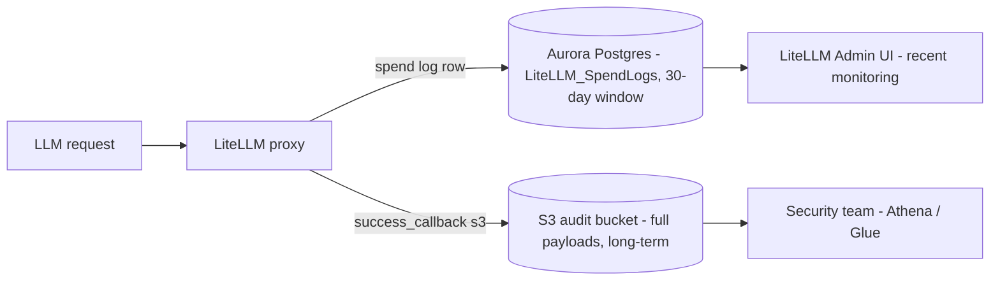

# LiteLLM Data Retention & Log Offload

How to keep the LiteLLM request/response audit trail for the security team while keeping
RDS (Aurora PostgreSQL) small and the Admin UI useful. Covers the one-time cleanup of the
oversized `LiteLLM_SpendLogs` table and the ongoing steady-state design.

Grounded in LiteLLM's config reference:
[config_settings](https://docs.litellm.ai/docs/proxy/config_settings) and
[s3 logging](https://docs.litellm.ai/docs/proxy/logging).

---

## 1. Problem

The `LiteLLM_SpendLogs` table has grown to ~180GB. The cause is
`store_prompts_in_spend_logs: true`, which writes the full prompt + response payload into
Postgres on every request. We need to:

1. Hand the historical data to the **security team** (outside RDS).
2. **Purge** the table safely.
3. Prevent unbounded regrowth while keeping the **Admin UI** useful.

---

## 2. How LiteLLM logging works (3 independent things)

These are separate systems - turning one on does not affect the others.

| Component | Backed by | Purpose |
| --- | --- | --- |
| Admin UI "Logs" + spend views | **Postgres** `LiteLLM_SpendLogs` | Operational monitoring in the LiteLLM UI |
| S3 logging callback | **S3 bucket** | Write-only audit/archive sink (full payloads) |
| Prometheus / Langfuse / Datadog | Their own stores | Metrics / tracing dashboards |

Key facts:

- The **UI reads only from Postgres**. S3 logging does **not** populate the UI.
- `store_prompts_in_spend_logs` controls whether the **prompt/response text** is stored in
  Postgres (and therefore visible in the UI). With it `false`, the UI still shows request
  **metadata** (model, tokens, cost, latency, key/user) - just not the message content.
- `disable_spend_logs: true` stops writing per-request rows entirely - the UI Logs tab goes
  empty (only aggregate key/user/team spend remains).



---

## 3. Target design

- **S3 = system of record for full payloads.** Continuous offload via the S3 callback;
  retention governed by an **S3 lifecycle policy** (e.g. 1-7 years, transition to Glacier).
  This is what the security team consumes (via Athena/Glue).
- **RDS = rolling 30-day window.** LiteLLM auto-purges spend logs older than 30 days so the
  table stays bounded and the UI stays fast.
- **UI = recent operational monitoring.** Works off the 30-day window in Postgres.

Two retention horizons, set independently:

| Store | Retention | Controlled by |
| --- | --- | --- |
| Aurora `LiteLLM_SpendLogs` | 30 days | `maximum_spend_logs_retention_period` |
| S3 audit bucket | As long as security needs | S3 bucket lifecycle policy |

---

## 4. Configuration

In `config/litellm_config.yaml`:

```yaml
litellm_settings:
  # 1) Full request/response payloads -> S3 (security team's store)
  success_callback: ["s3"]
  s3_callback_params:
    s3_bucket_name: security-litellm-audit
    s3_region_name: eu-west-1
    # s3_path: litellm-logs/

  # 2) Keep RDS spend logs for 30 days, then auto-purge
  maximum_spend_logs_retention_period: "30d"
  maximum_spend_logs_retention_interval: "1d"   # cleanup job cadence
  # maximum_spend_logs_cleanup_cron: "0 3 * * *"  # optional: cron instead of interval

  # 3) What the UI shows for the 30-day window:
  store_prompts_in_spend_logs: true   # true  = UI shows prompt/response text (bigger table)
                                      # false = UI shows metadata only (much smaller table)
```

Optional env var - partition the spend logs table so the 30-day purge is an instant
partition drop instead of row deletes (much lighter on Aurora):

```bash
SPEND_LOG_PARTITION_INTERVAL=day   # day | week | month
```

Decision to confirm: do you need the actual **prompt/response text in the UI** for the last
30 days?

- Yes -> keep `store_prompts_in_spend_logs: true` (table stabilizes at ~30 days of payloads).
- No  -> set `false`; the UI keeps metadata, full content lives only in S3 (smallest DB).

---

## 5. One-time cleanup of the existing 180GB

Do this **before** relying on the 30-day auto-purge. The retention job maintains steady state
but is not the efficient way to clear a large backlog.

### 5.1 Export to S3 (give it to security)

Preferred for a bulk one-time dump - **Aurora Snapshot Export to S3** (Parquet, zero load on
the live cluster, single table):

```bash
aws rds start-export-task \
  --export-task-identifier litellm-spendlogs-export \
  --source-arn <aurora-cluster-snapshot-arn> \
  --s3-bucket-name security-litellm-audit \
  --s3-prefix spendlogs/ \
  --iam-role-arn <export-role-arn> \
  --kms-key-id <kms-key> \
  --export-only "litellm.public.LiteLLM_SpendLogs"
```

Alternative - filtered export from the live DB with the Aurora S3 extension:

```sql
SELECT * FROM aws_s3.query_export_to_s3(
  'SELECT * FROM "LiteLLM_SpendLogs" WHERE "startTime" < now() - interval ''30 days''',
  aws_commons.create_s3_uri('security-litellm-audit','spendlogs/pre-30d','eu-west-1'),
  options := 'format csv, header true'
);
```

### 5.2 Verify, then purge

After security confirms they can read the export (e.g. via Athena):

- If keeping the last 30 days, **batched delete** (do not delete 180GB in one transaction):

```sql
-- Repeat until 0 rows affected
DELETE FROM "LiteLLM_SpendLogs"
WHERE ctid IN (
  SELECT ctid FROM "LiteLLM_SpendLogs"
  WHERE "startTime" < now() - interval '30 days'
  LIMIT 20000
);
```

- If wiping everything after export: `TRUNCATE "LiteLLM_SpendLogs";` (instant, reclaims all
  space).

### 5.3 Reclaim space

`DELETE` does not return space to storage. Use **`pg_repack`** (online, no long exclusive
lock) rather than `VACUUM FULL` (which locks the table). Aurora releases freed storage after.

---

## 6. S3 audit bucket (security team)

- Dedicated bucket (e.g. `security-litellm-audit`), **SSE-KMS** encryption, **Block Public
  Access** on, versioning on, bucket policy granting the security team read.
- **Lifecycle policy** for long-term retention independent of RDS:
  - Transition to Glacier/Deep Archive after N days.
  - Expire after the security-mandated period (e.g. 1-7 years).
- Optionally a **Glue crawler + Athena** so security can query payloads with SQL.

---

## 7. Action checklist

- [ ] Confirm size/time span: `SELECT pg_size_pretty(pg_total_relation_size('"LiteLLM_SpendLogs"')), count(*), min("startTime"), max("startTime") FROM "LiteLLM_SpendLogs";`
- [ ] Create the S3 audit bucket (KMS, lifecycle) + export IAM role.
- [ ] Enable the **S3 logging callback** so payloads start flowing going forward.
- [ ] **Snapshot-export** `LiteLLM_SpendLogs` to the audit bucket; security verifies via Athena.
- [ ] **Purge** the backlog (batched delete or truncate), then **`pg_repack`** to reclaim space.
- [ ] Set `maximum_spend_logs_retention_period: "30d"` (+ interval/cron) for ongoing purge.
- [ ] Decide `store_prompts_in_spend_logs` (UI shows content vs metadata only).
- [ ] Enable `SPEND_LOG_PARTITION_INTERVAL` so future purges are partition drops.

---

## 8. Verification

- [ ] New requests appear in the S3 bucket.
- [ ] LiteLLM UI Logs tab shows recent requests (content or metadata per your choice).
- [ ] Rows older than 30 days are auto-removed from `LiteLLM_SpendLogs`.
- [ ] Table size is stable and far below 180GB after repack.
- [ ] Security team can query the S3 export (Athena) and ongoing logs.

---

## 9. Open items

- Keep prompt/response **text in the UI** for 30 days, or metadata only (S3 holds full content)?
- Security-mandated **S3 retention** period (drives the lifecycle policy).
- Use table **partitioning** now (recommended) so purges are instant partition drops?
