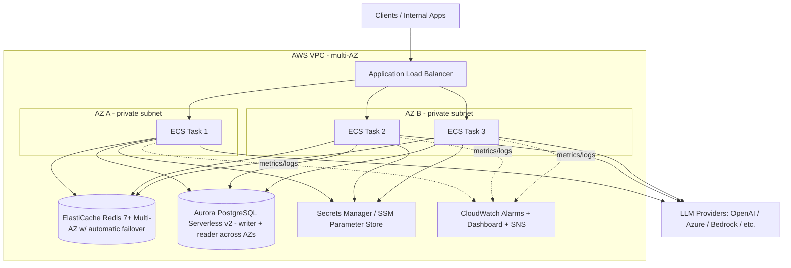
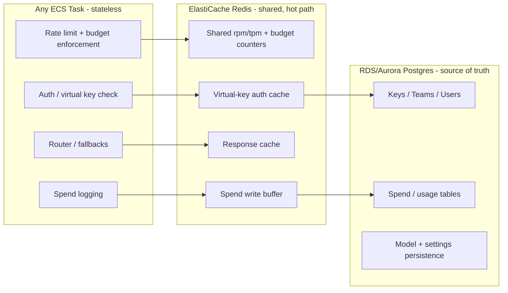
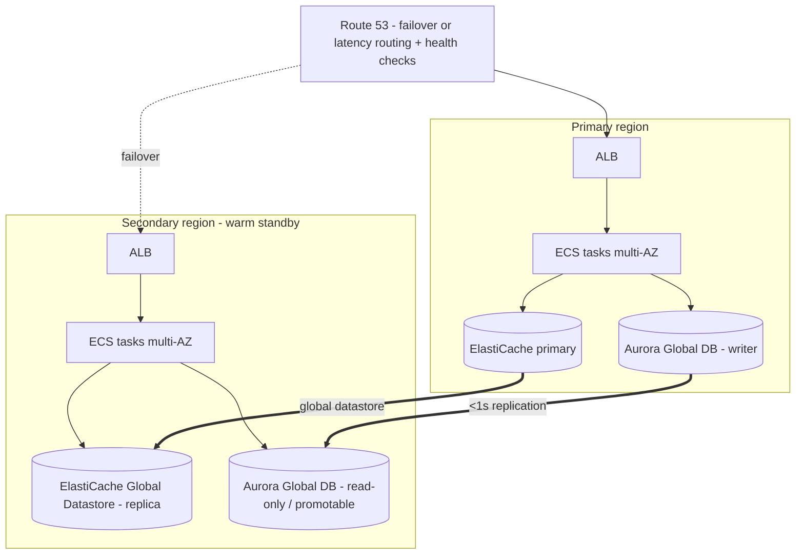

# LiteLLM High Availability Architecture

This document describes how to evolve the current LiteLLM proxy deployment (single ECS
task + RDS Postgres) into a highly available, horizontally scalable AI gateway on AWS,
with no single point of failure and hitless deployments.

It is grounded in LiteLLM's official production guidance:

- [Best Practices for Production](https://docs.litellm.ai/docs/proxy/prod)
- [Docker, Helm, Terraform (Deploy)](https://docs.litellm.ai/docs/proxy/deploy)
- [Proxy - Load Balancing](https://docs.litellm.ai/docs/proxy/load_balancing)
- [config_settings reference](https://docs.litellm.ai/docs/proxy/config_settings)

---

## 1. Current state and the core problem

| Layer | Today | Risk |
| --- | --- | --- |
| App | Single ECS service / 1 task | Any task crash, AZ failure, or deploy = full outage |
| Database | Single RDS Postgres (likely Single-AZ) | Hard dependency for keys/spend/budgets; SPOF |
| Shared state | None | Cannot safely run >1 task: rate limits / budgets / tpm-rpm drift per instance |
| Deploys | Restart in place | Dropped in-flight requests during deploy |

The system is now business critical, so every layer needs redundancy and the app must be
able to scale out. Running more than one ECS task **requires** a shared state layer
(Redis), otherwise each task only enforces rate limits and budgets against its own local
counters.

---

## 2. Target architecture



### What changes vs. today

1. ECS scales from 1 task to **2-3 tasks across at least 2 AZs**, behind the ALB.
2. **ElastiCache Redis (Multi-AZ)** is added as the shared state + cache layer.
3. **Aurora PostgreSQL Serverless v2** runs a writer + a reader in a second AZ for
   automatic failover (today a single instance would be a SPOF).
4. Deploys become **hitless** (rolling, with draining and circuit breaker).
5. **Observability**: Prometheus metrics, JSON logs, CloudWatch alarms + dashboard.

---

## 3. State and data flow ("the new schema")

The key architectural idea: **LiteLLM proxy tasks become stateless**. All shared state
lives in Redis and Postgres, so any task can serve any request and tasks can be added or
removed freely.



| Concern | Where it lives | Why |
| --- | --- | --- |
| Virtual-key auth | Redis cache, backed by Postgres | Avoids a DB read on every request (`enable_redis_auth_cache`) |
| Rate limits (rpm/tpm) | Redis | Must be **global** across all tasks, not per-task |
| Budgets | Redis + Postgres | Enforced globally, persisted to DB |
| Spend / usage logs | Buffered in Redis, flushed to Postgres | Prevents DB connection exhaustion under load |
| Response cache | Redis | Shared cache hits across tasks |
| Model list / settings | `config.yaml` + Postgres | Source of truth for config |

### Request lifecycle

1. Client -> ALB -> any ECS task (round-robin / least-outstanding).
2. Task validates the virtual key (Redis auth cache, fallback to Postgres).
3. Task checks shared rpm/tpm + budget counters in Redis.
4. Router selects a deployment (`simple-shuffle`) and calls the provider, with
   fallbacks/cooldowns/retries.
5. Spend is buffered in Redis and flushed to Postgres in batches.

---

## 4. Actions to perform

> You already have Terraform for RDS, ElastiCache, and the ECS service. The items below
> are the **specific settings to apply** to those existing resources, plus the new
> CloudWatch Terraform provided in this repo (`terraform/cloudwatch.tf`).

### 4.1 ElastiCache Redis

- [ ] Engine version **7.0+** (Redis or Valkey).
- [ ] **Multi-AZ enabled** with **automatic failover** (primary + at least one replica in a
      different AZ). For Terraform this is a replication group with
      `automatic_failover_enabled = true`, `multi_az_enabled = true`,
      `num_cache_clusters >= 2`.
- [ ] In-transit + at-rest encryption enabled; `AUTH` token (password) set.
- [ ] Security group: allow `6379` only from the ECS task security group.
- [ ] Expose `REDIS_HOST` (primary endpoint), `REDIS_PORT`, `REDIS_PASSWORD` to ECS via
      Secrets Manager / SSM.

LiteLLM wiring is in [`config/litellm_config.yaml`](../config/litellm_config.yaml):
use `redis_host` / `redis_port` / `redis_password` (NOT `redis_url`, which is ~80 RPS
slower per LiteLLM docs), with `cache: true`, `use_redis_transaction_buffer: true`, and
`enable_redis_auth_cache: true`.

### 4.2 Database - Aurora PostgreSQL Serverless v2

You are running **Aurora PostgreSQL Serverless v2**. The HA and tuning concerns are
different from provisioned RDS - storage auto-scales, connection limits scale with ACUs,
and HA depends on having a reader instance in a second AZ.

- [ ] **HA requires >= 2 instances**: one writer + at least one **reader in a different AZ**.
      A single Serverless v2 instance is a SPOF (Aurora promotes a reader on failover). Set
      this in the cluster (`aws_rds_cluster_instance` count >= 2 across AZs).
- [ ] **Capacity range**: set `serverlessv2_scaling_configuration` `min_capacity` /
      `max_capacity` (ACUs). Do **not** set `min_capacity` too low - `max_connections`
      scales with ACUs, so a tiny floor throttles connections during scale-out and adds
      cold-ish scale-up latency under bursts. Pick a floor that comfortably covers your
      steady-state connection count (see connection math).
- [ ] **Endpoints**: point writes at the **cluster (writer) endpoint** via `DATABASE_URL`,
      and reads at the **reader endpoint** via `DATABASE_URL_READ_REPLICA` so read-only
      queries (`find_*`, counts, etc.) leave the writer headroom.
- [ ] **Backups + protection**: backup retention / PITR enabled, `deletion_protection = true`,
      defined maintenance window. (Storage is managed by Aurora - no storage sizing needed.)
- [ ] **Connections**: consider **RDS Proxy** in front of the cluster if connection counts
      spike during ECS scale-out or failover - it pools/multiplexes and smooths failover.
- [ ] Encryption at rest (KMS) + in transit (TLS / `sslmode=require`).

**Connection math** (critical to avoid exhaustion):

```
total_connections = database_connection_pool_limit  x  num_workers_per_task  x  num_tasks
```

With one worker per task (recommended), `database_connection_pool_limit: 10`, and 3 tasks
=> 30 connections. On Serverless v2, `max_connections` is derived from current ACUs
(roughly proportional to memory), so ensure your **`min_capacity` floor** supports the
peak `total_connections` even before autoscaling kicks in. Using RDS Proxy decouples
client connections from DB connections and is the safest option as you scale tasks.

### 4.3 ECS service

- [ ] Run **minimum 2 tasks (recommend 3)** spread across **>= 2 AZs**.
- [ ] Place tasks in private subnets; ALB in public (or internal) subnets.
- [ ] **Health check on `/health/readiness`** (ALB target group health check path).
- [ ] **One Uvicorn worker per task** (`--num_workers 1`); scale **horizontally** (more
      tasks), not vertically (more workers/task) - predictable latency + accurate
      autoscaling.
- [ ] **Pin the image** to a specific version/digest (e.g.
      `litellm:main-v1.xx.x` or `@sha256:...`), never `main-stable`.
- [ ] Resources: start at **~1 vCPU + 4 GB per worker**; tune from load tests.
- [ ] **Service Auto Scaling**: target tracking on **~60% CPU** (and/or ~80% memory),
      min 2-3, sensible max.

### 4.4 Hitless deploys

- [ ] Rolling update: `deployment_minimum_healthy_percent = 100`,
      `deployment_maximum_percent = 200`.
- [ ] **Deployment circuit breaker with rollback** enabled.
- [ ] ALB target group **deregistration delay** and ECS task **stop timeout** set
      **above the longest expected request** (LiteLLM `request_timeout` default is 600s),
      so in-flight requests drain before a task is killed.

### 4.5 Migrations

- [ ] Run DB migrations as a **separate one-off task / pipeline step** with
      `USE_PRISMA_MIGRATE=True`.
- [ ] Set `DISABLE_SCHEMA_UPDATE=true` on the **serving** tasks so multiple tasks don't
      race on migrations during a deploy.

### 4.6 Config, secrets, resilience

- [ ] `LITELLM_MODE=PRODUCTION` (disables `.env` autoload).
- [ ] Stable `LITELLM_SALT_KEY` (**never change after adding models** - it encrypts stored
      provider keys).
- [ ] `LITELLM_MASTER_KEY` (starts with `sk-`), stored in Secrets Manager / SSM.
- [ ] `allow_requests_on_db_unavailable: true` (VPC-only) so LLM traffic keeps flowing
      during brief DB blips - this is core to "always up".
- [ ] Slack alerting via `SLACK_WEBHOOK_URL`.

### 4.7 Observability (provided in this repo)

- [ ] Apply [`terraform/cloudwatch.tf`](../terraform/cloudwatch.tf): SNS topic, alarms for
      ALB 5xx / target health, ECS running task count + CPU/memory, Aurora CPU / connections /
      freeable memory / replica lag / **ACU utilization + serverless capacity**, ElastiCache
      CPU / evictions / replication lag, plus a consolidated dashboard. (No free-storage
      alarm - Aurora storage auto-scales.)
- [ ] Scrape LiteLLM **Prometheus** metrics and ship **JSON logs** to CloudWatch / S3 /
      Datadog.

---

## 5. Rollout order (lowest risk first)

1. Add ElastiCache Redis (Multi-AZ) and wire config; keep **1 task** to validate caching +
   auth cache.
2. Ensure the Aurora Serverless v2 cluster has a **reader in a second AZ** and a sensible
   `min/max_capacity`; **test failover** by rebooting the writer with failover.
3. Move migrations to a dedicated step; set `DISABLE_SCHEMA_UPDATE=true` on serving tasks.
4. Scale ECS to **2-3 tasks** across AZs; add autoscaling + hitless rolling deploy + ALB
   drain timing.
5. Apply CloudWatch alarms/dashboard, wire SNS to your on-call, then **load test** to
   finalize pool limits, task count, and Redis connections.

---

## 6. Verification checklist

- [ ] Kill one ECS task -> traffic continues via the others (ALB routes around it).
- [ ] Trigger Aurora failover (reboot writer with failover) -> reader promoted, brief blip,
      gateway recovers automatically; `allow_requests_on_db_unavailable` keeps LLM traffic up.
- [ ] Trigger ElastiCache failover -> rate limiting/caching recover automatically.
- [ ] Deploy a new version -> zero dropped in-flight requests (hitless).
- [ ] Rate limits / budgets enforced **globally** (test from 2 tasks simultaneously).
- [ ] Alarms fire into SNS / Slack; dashboard shows all layers.

---

## 7. Multi-region

Today everything runs in one region. Multi-AZ (Sections 1-6) protects against an AZ
failure; **multi-region** protects against a full **region** outage and can lower latency /
satisfy data residency. Pick a strategy first - it determines everything else.

### 7.1 Choose a strategy

The hard part is **shared state**. LiteLLM enforces budgets and rpm/tpm rate limits from a
single shared Postgres + Redis. Spanning regions forces a choice about that state.

| Strategy | How it works | Rate limits / budgets | RTO / RPO | Best when |
| --- | --- | --- | --- | --- |
| **A. Active-passive DR** (recommended start) | Full stack in primary; warm standby in secondary. Aurora **Global Database** + ElastiCache **Global Datastore** replicate one-way. Route 53 fails traffic over. | Stay **global & consistent** (single logical primary) | RTO ~minutes, RPO ~1s (Aurora Global DB) | You want region resilience with the least complexity and unchanged limit semantics |
| **B. Active-active, independent regions** | Each region is a **fully independent** LiteLLM deployment (own Aurora, own Redis, own keys). LiteLLM's [High Availability Control Plane](https://docs.litellm.ai/docs/proxy/high_availability_control_plane) gives one UI over many independent workers. Route 53 latency-based routing. | **Per-region** (NOT global) - a key's limit/budget is enforced separately in each region | RTO ~seconds (both live), RPO n/a per region | You need lowest latency, data residency, and blast-radius isolation, and can accept per-region limits |
| **C. Active-active, shared primary DB** | Both regions' ECS talk to the primary region's Aurora writer + primary Redis. | Global & consistent | Poor | Almost never - adds a cross-region hop to the hot path (latency + cross-region $) |

**Decision (phased):**

- **Phase 1 - adopt Strategy A (active-passive DR).** It gives true region resilience while
  keeping global rate-limit/budget semantics and requiring no app-level changes. This is the
  path we implement now (Section 7.2).
- **Phase 2 - Strategy B (active-active independent regions) as a future option.** Only move
  here if you later need active-active latency, data residency, or blast-radius isolation, and
  can accept **per-region** limits. Actions documented in Section 7.3 so the path is understood
  up front; Section 7.5 explains the delta from A to B.



### 7.2 Actions - Strategy A (active-passive DR)

Data layer
- [ ] Convert Aurora to an **Aurora Global Database**: add a secondary-region cluster
      (read-only, promotable). Replication lag is typically <1s (RPO ~1s).
- [ ] Add **ElastiCache Global Datastore** to replicate Redis to the secondary region
      (secondary is read-only until promoted).
- [ ] In the secondary, the proxy runs against the **local read replica**; on failover you
      **promote** the secondary Aurora + ElastiCache to writable.

Compute + routing
- [ ] Stand up the **same ECS service (multi-AZ) + ALB** in the secondary region, scaled
      down (warm standby) or to zero with fast scale-up.
- [ ] **Route 53 failover routing** with **health checks** against `/health/readiness` of
      each region's ALB. Optionally use **Global Accelerator** for faster failover and
      static anycast IPs.
- [ ] Per-region **ACM certificates** and (if used) **WAF** web ACLs.

Config, images, secrets (must be identical across regions)
- [ ] **`LITELLM_SALT_KEY` must be identical in both regions** - it decrypts provider keys
      stored in the (replicated) DB. A mismatch makes the standby unable to read credentials.
- [ ] Same `LITELLM_MASTER_KEY` (shared logical DB).
- [ ] Replicate **Secrets Manager** secrets cross-region (multi-region secrets) and use
      **multi-region KMS keys**.
- [ ] Replicate the container image to the secondary region's **ECR** (ECR cross-region
      replication) and pin the **same image digest**.
- [ ] Ship the **same `config.yaml`** to both regions (e.g. S3 bucket with Cross-Region
      Replication, or identical config in each region's pipeline).

Operational
- [ ] Run DB **migrations once** against the global cluster's primary writer.
- [ ] Replicate observability: deploy the CloudWatch alarms/dashboard
      ([`terraform/cloudwatch.tf`](../terraform/cloudwatch.tf)) **in each region**, pointing
      at that region's resources; aggregate alerts into one SNS/on-call.

### 7.3 Actions - Strategy B (active-active, independent regions)

In B there is **no shared state** between regions: each region is a self-contained LiteLLM
deployment that serves live traffic. This follows LiteLLM's
[High Availability Control Plane](https://docs.litellm.ai/docs/proxy/high_availability_control_plane)
model - independent "workers", optionally managed by one control-plane UI.

Data layer (per region, independent)
- [ ] Each region has its **own Aurora cluster** and **own ElastiCache** - **not** Global
      Database / Global Datastore. State is regional by design.
- [ ] No cross-region DB/Redis replication on the hot path (that would be Strategy C).
- [ ] Optionally, for DR *within* B, give each region its own intra-region multi-AZ HA
      (Sections 2 + 4.1) so a single region is still resilient.

Compute + routing
- [ ] Run the **full ECS service (multi-AZ) + ALB in every active region**, each sized for
      that region's live traffic (not a scaled-down standby).
- [ ] **Route 53 latency-based (or geolocation) routing** so users hit the nearest region;
      each record has its own **health check** on `/health/readiness`. If a region fails,
      Route 53 stops routing to it and the survivors absorb the load (size for this).
- [ ] Per-region **ACM certificates** and **WAF** web ACLs.

Identity, keys, and limits (the key difference from A)
- [ ] Each worker has its **own `master_key` and `database_url`** (independent admin domains).
- [ ] Each worker sets **`control_plane_url`** in `general_settings` to allow the central
      control-plane UI to authenticate/manage it (optional but recommended for one-pane ops).
- [ ] **Budgets and rpm/tpm are enforced per region** - a key with 100 rpm can do ~100 rpm in
      *each* region. To bound global usage, either (a) set per-region limits that **sum** to
      your target, or (b) keep limits global by staying on Strategy A.
- [ ] Decide **key/user provisioning** across regions: create keys independently per region,
      or automate identical provisioning into each region's DB (e.g. via the management API /
      Terraform), or use the control plane. Use the **same `LITELLM_SALT_KEY`** in any region
      that must read the same encrypted provider credentials.

Config, images, operational
- [ ] Same pinned **image digest** in each region's ECR; same `config.yaml` (or per-region
      `model_list` if you want region-local provider endpoints for latency/residency).
- [ ] Run **migrations independently against each region's** Aurora primary (each DB is its
      own schema lifecycle).
- [ ] Deploy the CloudWatch alarms/dashboard ([`terraform/cloudwatch.tf`](../terraform/cloudwatch.tf))
      **per region**; aggregate alerts into one on-call.

### 7.4 Failover runbook (Strategy A)

1. Confirm the primary region is actually down (ALB health checks failing, alarms firing).
2. **Promote** the secondary Aurora Global Database cluster to a standalone writer.
3. **Promote** ElastiCache Global Datastore secondary to primary (writable).
4. Point the proxy's `DATABASE_URL` / `REDIS_HOST` at the now-writable secondary endpoints
   (parameterize via Secrets Manager so this is a value change, not a redeploy).
5. **Scale up** the secondary ECS service; Route 53 health checks shift traffic
   automatically (or flip the failover record manually).
6. After the primary recovers, rebuild replication in the reverse direction before failing
   back during a maintenance window.

> Practice this runbook with a game day. Track the actual RTO and make sure
> `allow_requests_on_db_unavailable` keeps the gateway serving during the cutover blip.

### 7.5 What changes going from A to B

| Aspect | A (active-passive DR) | B (active-active independent) |
| --- | --- | --- |
| Secondary region traffic | Idle/warm until failover | Serves live traffic continuously |
| Aurora | One **Global Database** (1 writer, replicas) | **Separate** cluster per region |
| ElastiCache | **Global Datastore** (replicated) | **Separate** Redis per region |
| Rate limits / budgets | **Global & consistent** | **Per region** |
| `master_key` / `database_url` | Shared (one logical DB) | **Unique per region** |
| Route 53 | **Failover** routing | **Latency/geo** routing |
| Failover | Promote DB/Redis, scale up (runbook 7.4) | Automatic - Route 53 drops the dead region |
| Migrations | Once (global primary) | Once **per region** |

Migration A -> B later means: split the Global Database into independent regional clusters,
give each region its own Redis + `master_key`, switch Route 53 from failover to latency
routing, scale the second region up to full size, and reconcile how you provision keys/budgets
across the now-independent control domains.

---

## 8. Open items to confirm

- Database: **Aurora PostgreSQL Serverless v2** (confirmed). Confirm there is a reader
  instance in a second AZ and the chosen `min/max_capacity` (ACU) range.
- Multi-region: **Phase 1 = Strategy A (active-passive DR)** is chosen; B is a documented
  future option (Section 7.3 / 7.5). Confirm the **secondary region** and target **RTO/RPO**
  so Aurora Global Database + ElastiCache Global Datastore + Route 53 failover can be sized.
- Expected peak RPS once known, to finalize task count and connection-pool math.
